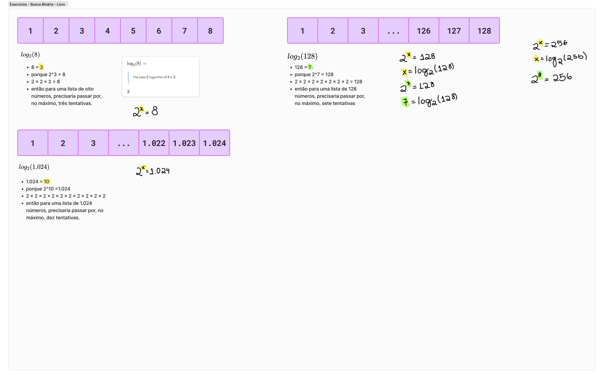

# Busca Simples & Busca Binária

Hoje vamos falar sobre busca simples e busca binária. O que vou escrever aqui é
baseado na leitura do livro: [Entendendo Algoritmos: Um Guia Ilustrado Para
Programadores e Outros Curiosos](https://www.amazon.com.br/Entendendo-Algoritmos-Ilustrado-Programadores-Curiosos/dp/8575225634)

> 🌠 O que vou escrever aqui é baseado no que eu entendi ;)

## O que é uma busca simples?

Uma busca simples é aquela que consiste em **percorrer uma lista** para encontrar o dado desejado. Mas qual o problema com isso? 
  
- Na busca simples, é preciso percorrer a toda a lista para achar determinado valor. Então se a gente tem uma lista com 1.000 elementos, no pior dos casos é o nosso valor estar no final. 

</br>

*Código da busca simples usando Python*
```python
listaDeNumeros = [1,2,3,4,5,6,7,8];

def buscaSimples(numeroParaBusca):
    numeroDeOperacoes = 0

    for x in listaDeNumeros:
        numeroDeOperacoes+=1

        if(x == numeroParaBusca):
            print("Achei o número: ", x)
            break

    print("Número de operações: ", numeroDeOperacoes)

```

## O que é uma busca binária:

A busca binária é um eficiente algoritmo para encontrar um item em uma **lista ordenada** de itens.
- é um bom algoritmo para trabalhar com listas ordenadas
- ela funciona dividindo repetidamente pela metade a porção da lista que deve conter o item, até reduzir as localizações possíveis à apenas uma.
- na busca binária a gente usa **ponteiros** para conseguir dividir a lista repetidamente.
  
</br>

*Código da busca binária usando Python*
```python
listaDeNumerosPequena = [1,2,3,4,5,6,7,8]
listaDeNumerosGrande = [1,2,3,4,5,6,7,8,9,10,11,12,13,14,15,16,17,18,19,20]
listaDeNumerosMuitoGrande = list(range(1, 1001))

def buscaBinaria(numeroParaBusca):
    numeroDeOperacoes = 0

    ponteiroInicio = 0
    ponteiroFinal = len(listaDeNumeros)

    while(ponteiroInicio <= ponteiroFinal):
        ponteiroMeio = int((ponteiroFinal + ponteiroInicio) / 2)

        if(listaDeNumeros[ponteiroMeio] == numeroParaBusca):
            print("Busca Binária: achei o número: ", listaDeNumeros[ponteiroMeio])
            break

        if(numeroParaBusca > listaDeNumeros[ponteiroMeio]):
            ponteiroInicio = ponteiroMeio + 1
        
        if(numeroParaBusca < listaDeNumeros[ponteiroMeio]):
           ponteiroFinal = ponteiroMeio - 1

        numeroDeOperacoes+=1
    
    print("Número de operações (Binário): ", numeroDeOperacoes)
```


## Comparação:

Vamos fazer a comparação de três listas, ambas usando busca simples e busca binária

```python
listaDeNumerosPequena = [1,2,3,4,5,6,7,8,9,10]
listaDeNumerosGrande = [1,2,3,4,5,6,7,8,9,10,11,12,13,14,15,16,17,18,19,20]
listaDeNumerosMuitoGrande = list(range(1, 1001))
```

### Lista com 10 elementos:
``buscando o número 8``
- **busca simples**: 8 operações
- **busca binária**: 1 operação
  
### Lista com 20 elementos:
``buscando o número 18``
- **busca simples**: 18 operações
- **busca binária**: 2 operações
  
### Lista com 1.000 elementos:
``buscando o número 999``
- **busca simples**: 999 operações
- **busca binária**: 8 operações


## Resolução dos Exercícios:


