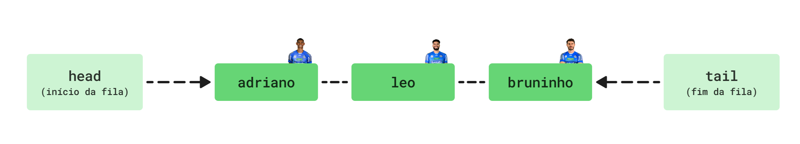
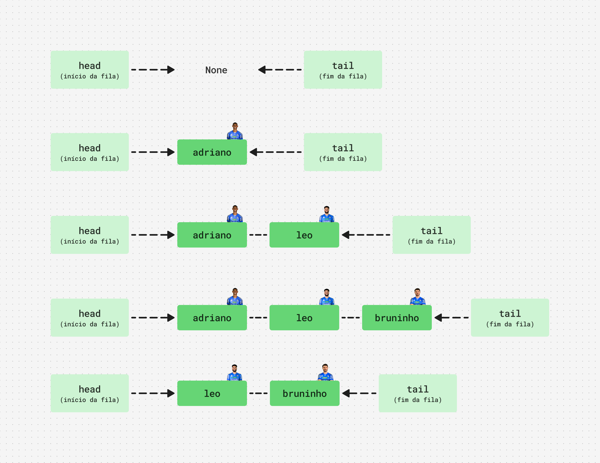

# Fila (Queue)

Uma **Queue (fila)** é uma estrutura de dados linear que segue o princípio `FIFO (First In, First Out)`, ou seja, **o primeiro elemento inserido é o primeiro a ser removido**. É como uma fila normal, tipo fila de supermercado ou de ingressos para um show.

Imagine uma fila para retornar uniformes:
- adriano chegou no local para retirar o uniforme. Ele então fica na fila aguardando.
- depois chegou mais dois atletas: leo e bruninho, ambos entraram na fila. 
- **o atleta que chegou primeiro vai ser o primeiro a ser atendido** (adriano).

 

 

## Principais Operações:
1. `enqueue(elemento)`: adiciona um elemento ao final da fila.
2. `dequeue()`: remove e retorna o primeiro elemento da fila.
3. `peek()`: retorna o primeiro elemento da fila.
4. `isEmpty()`: verifica se a fila está vazia.
5. `size()`: retorna o tamanho da fila.

## Implementando uma Fila:
Como a **Fila** precisa inserir e remover elementos no começo e fim, a **Lista Encadeada (Linked List)** pode fazer isso em `O(1)` tempo constante, pois a inserção e remoção no início/final de uma lista encadeada são operações rápidas, e no caso vamos usar ponteiros para indicar o fim da fila.

### `enqueue(elemento)`: O(1) 
- sempre insere o elemento no fim da fila.
- como estamos usando `head` e `tail` conseguimos atualizar o fim da fila de forma rápida.
- colocamos que `tail.proximo` e `tail` vai ser igual ao novo elemento.
- **tempo constante**.

### `dequeue()`: O(1) 
- remove o elemento que está no começo da fila.
- `head` é atualizado para `head.proximo`.
- **tempo constante**.

### `peek()`: O(1) 
- retorna o primeiro elemento da fila.
- **tempo constante**.

### `isEmpty()`: O(1) 
- verifica se a fila está vazia.
- **tempo constante**

### `size()`: O(1) 
- retorna o tamanho da fila
- como estamos usando um contador o método roda em **tempo constante**.

## Lógica visual de como funciona uma Fila:

1. A fila começa vazia, então `head` e `tail` apontam para um valor None.
2. **Adriano** é o primeiro atleta da fila, então `head` e `tail` apontam para ele.
3. E logo após temos novos atletas chegando a fila, como: **Leo** e **Bruninho**.
4. **Bruninho** é o último da fila então `tail` agora aponta para ele.
5. Os atendimentos começaram e o **Adriano** foi o primeiro a ser atendido, já que ele era o primeiro da fila.

E por fim temos um `head` apontando para o próximo da fila. 

 

 
