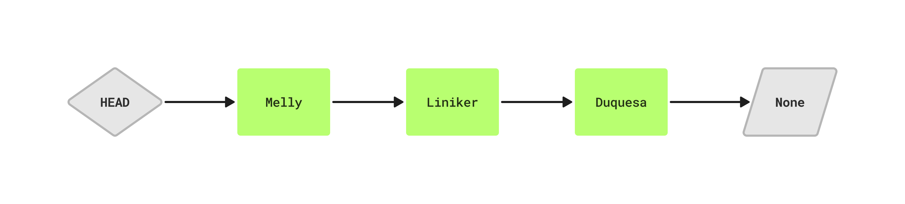
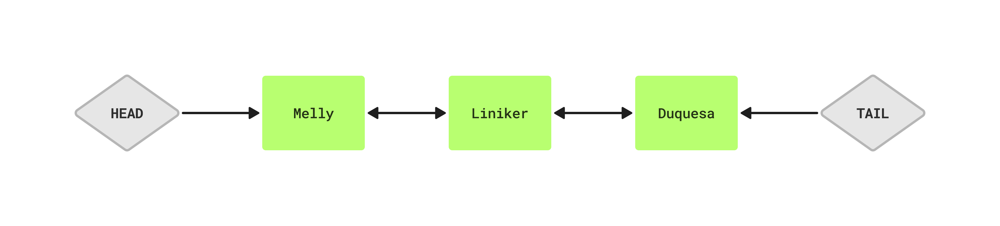

# Lista Encadeada (Linked List)

Uma Lista Encadeada (Linked List) **é uma estrutura de dados linear composta por nós (nodes)**, onde cada nó contém:
1. **dados**: o valor armazenado no nó
2. **ponteiro**: uma referência para o próximo nó

> Ao contrário de arrays, **as listas encadeadas não têm tamanho fixo e não exigem realocação de memória ao adicionar novos elementos.**

## Armazenamento na Memória:
As listas encadeadas **armazenam os nós dispersos pela memória, e cada nó contém um ponteiro que indica a posição nó.** Diferente de arrays, que ocupam um bloco contínuo de memória, as listas encadeadas utilizam endereços dinâmicos.

## Tipos de Listas Encadeadas:

### Lista Encadeada Simples (Singly Linked List)

- cada nó aponta para o próximo
- percorrido apenas em um sentido.

### Lista Duplamente Encadeada (Doubly Linked List)
- cada nó tem um ponteiro para o próximo e para o anterior.
- pode ser percorrida em ambos os sentidos.
  

### Lista Encadeada Circular (Circular Linked List)
- o último nó aponta de volta para o primeiro, formando um círculo.
  

## Complexidade das Operações

A complexidade pode mudar de acordo com o tipo de lista encadeada. Uma lista duplamente encadeada, onde indicamos quem é o `head` e `tail`, conseguimos mudar uma complexidade de O(n) para O(1).

| Operação      | Complexidade |
| :---          |    :----:   |  
| Leitura      | O(n)       |
| Inserção no início   |  O(1)|
| Inserção no final   | O(n)|
| Remoção no início  |  O(1)|
| Remoção no meio  | O(n)|
| Remoção no final  |  O(n)|

