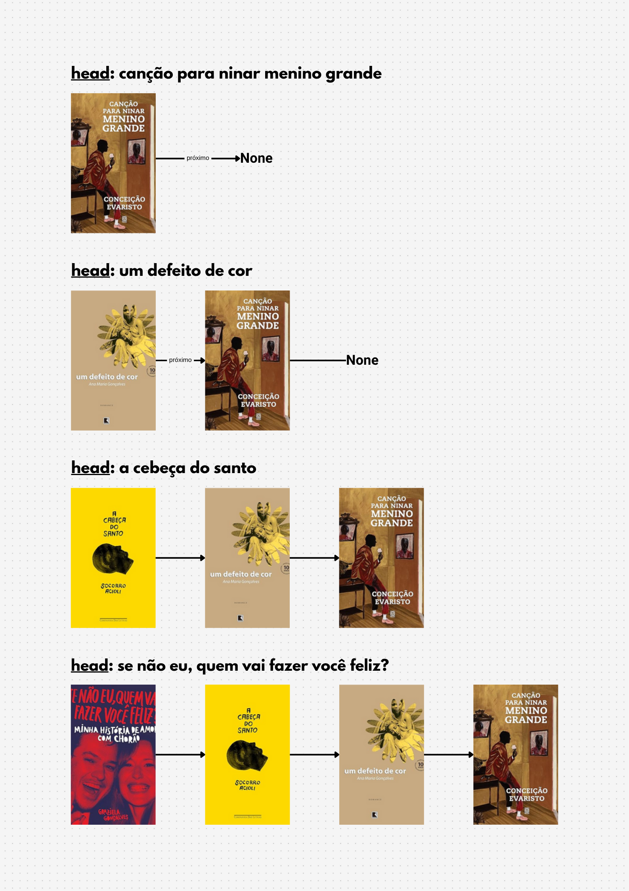

# Pilha (Stack)

**Pilha (ou stack)** é uma estrutura de dados do tipo `LIFO (Last In, First Out)`, ou seja, **o último elemento a entrar é o primeiro a sair.**

Imagine uma pilha de livros:
- você empilha os livros um sobre o outro.
- quando precisa pegar um livro, você pega o que está no topo da pilha (o último livro que foi adicionado na pilha).

</br>


## Principais Operações:
1. `push(elemento)`: adiciona um elemento ao topo da pilha
2. `pop()`: remove e retorna o elemento do topo.
3. `peek()`: retorna o elemento do tipo sem removê-lo
4. `isEmpty()`: verifica se a pilha está vazia.
5. `size()`: retorna o tamanho da pilha.

## Implementando uma Pilha:
Como a **Pilha** precisa inserir e remover elementos no topo, a **Lista Encadeada (Linked List)** pode fazer isso em `O(1)` tempo constante, pois a inserção e remoção no início/final de uma lista encadeada são operações rápidas.

### `push(valor)`: O(1) 
- sempre insere um novo elemento no topo.
- operações de **tempo constante**, pois apenas muda a referência do `head`

### `listar()`: O(n)
- precisa percorrer toda a pilha para imprimir os elementos.
- como faz um loop até o final, a complexidade é O(n)
-  **tempo linear**.


### `peek()`: O(1)
- retorna o topo da pilha `head` sem percorrer nada.
- **tempo constante**.

### `pop()`: O(1)
- remove e retorna o topo da pilha
- então primeiro ele guarda uma referência do `head` atual e depois remove ele.
- atualiza o topo da pilha, agora `self.head` aponta para o próximo do head antigo.

### `size()`: O(n)
- precisa contar os elementos da pilha percorrendo a pilha toda.
- mas é possível ser em **tempo constante**, só precisamos declarar uma variável de contagem de elementos. E ao usar as operações `push` e `pop` atualizar a variável.
  

## Lógica visual de como funciona uma Pilha:

1. Ao adicionar o primeiro livro, o `head` fica como: **Canção Para Ninar Menino Grande**. 
2. Como ele é o primeiro livro a ser adicionado a pilha, o próximo fica como `None`.
3. Ao adicionar o segundo livro, o `head` fica como: **Um defeito de Cor**. 
4. Já existe um livro na pilha, então indicamos que o próximo livro da pilha é **Canção Para Ninar Menino Grande**;

E assim por diante, dessa forma o `head` sempre vai estar apontado para o topo da pilha. Ao final, a pilha ficaria assim:
```python
pilha.listar()
# Se não eu, quem vai fazer você feliz?
# A cabeça do santo
# Um defeito de cor
# Canção para ninar menino grande
```
- o primeiro a ser exibido é aquele que foi adicionado por último na pilha.

</br>

</br>

